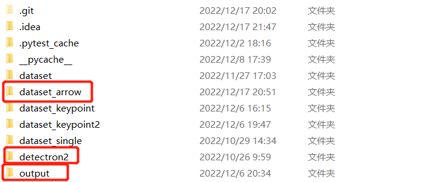
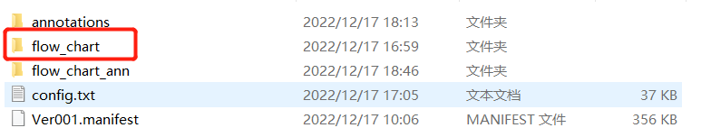

##### Detection2 Installation Tutorial

- Notice：You need to install pytorch first, or you'll get an error

- Download the archive：

```
git clone https://github.com/facebookresearch/detectron2.git
```

- Installation：

```
python -m pip install -e detectron2
```

- CPU running example (this is for the example, try it out)

```
python demo/demo.py --config-file configs/COCO-InstanceSegmentation/mask_rcnn_R_50_FPN_3x.yaml \
--input .\input.jpg \
--output .\output.jpg \
--opts MODEL.DEVICE cpu
```

##### Train Data
- Run detection (with arrows)

  - Run detections (with arrow) and place the dataset in the detectron2 sibling directory (note the second detectron2 sibling directory, along with the existing output folder) :

  
  - Change dataset name: Change the dataset to dataset_arrow, change the flow_chart_new inside to flow_chart, and put config.txt in it：

  
  - Run the program (in the first detectron2 directory)：

  ```python
  python train_keypoint.py
  ```
